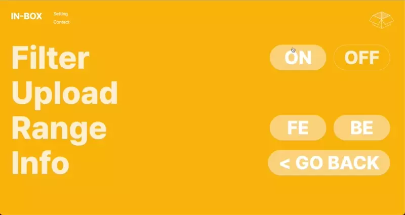
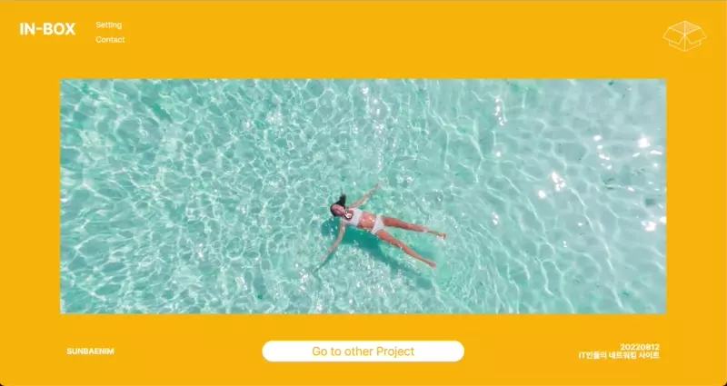
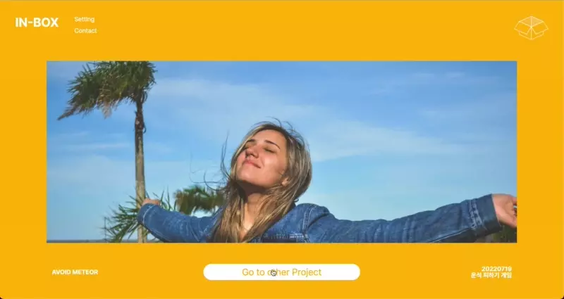

# IN-BOX Project
> 인박스 프로젝트의 프론트엔드 개발을 담당하였습니다.

## 실행
[Link](https://in-box.co.kr)

## 사용
- React
- Next.js
- TypeScript
- SCSS
- CSS module
- Recoil
- Amazon Lighthouse
- Amazon S3
- Google Analytics
- Google Search Console
- Hotjar

## 목차
- [기능](#기능)
- [구현](#구현)
- [트러블 슈팅](#트러블-슈팅)
- [보완점](#보완점)

---

## 기능

### 반응형
화면 사이즈 및 사용 기기 여부에 따라 웹사이트 크기 변화

### 포트폴리오 생성 기능
| 포트폴리오 생성               |
|----------------------------|
|  |

### Filter/Range 설정에 따른 포트폴리오 조회 기능
- `Filter` : 포트폴리오 영상 조회 시 영상을 덮는 썸네일에 대한 적용 여부 결정
- `Range` : FE(프론트엔드) 포트폴리오를 조회할 것인지, BE(백엔드) 포트폴리오를 조회할 것인지, 둘 다 조회할 것인지를 결정할 수 있는 옵션

| Filter 적용 시            | Filter 미적용 시          |
|-------------------------|-------------------------|
|  |  |

### 포트폴리오 썸네일 클릭 시 영상 조회 기능
Filter 설정이 On 상태여도, 썸네일을 클릭하면 바로 포폴 조회 가능
| Filter 이미지 클릭 시 영상 조회 기능 |
|-------------------------------|
|        |

### 포트폴리오 전환 및 애니메이션
| Fade-in and out 애니메이션      |
|-------------------------------|
|        |

---

## 구현

### 파일 및 폴더별 역할
__page/__

| 함수                 | 역할                            |
|---------------------|--------------------------------|
| home/`index`        | 메인 홈페이지                     |
| portfolios/`index`  | 포트폴리오 조회 페이지              |
| setting/`index`     | 포트폴리오 조회 옵션 및 업로드 페이지   |
| info/`index`        | 프로젝트 정보 소개 페이지            |

__components/UI__
| 함수                 | 역할                            |
|---------------------|--------------------------------|
| `FormBox`           | 메인 홈페이지의 박스 이미지          |
| `HeaderMenu`        | 헤더 메뉴의 텍스트 및 링크            |
| `HeaderBox`         | 헤더 메뉴의 박스 이미지               |
| `Header`            | 메뉴 컴포넌트를 모두 합친 부모 컴포넌트 |

__components/portfolio__
| 함수                 | 역할                            |
|---------------------|--------------------------------|
| `PortfolioContent`  | 포트폴리오 조회 및 전환 컴포넌트       |

__components/setting__
| 함수                 | 역할                            |
|---------------------|--------------------------------|
| `SettingList`       | 설정 페이지                       |
| `OnOffBtn`          | Filter On/Off 버튼              |
| `FeBeBtn`           | Range FE/BE 버튼                |

__components/upload__
| 함수                 | 역할                            |
|---------------------|--------------------------------|
| `Dropzone`          | 포트폴리오 업로드 컴포넌트            |
| `List`              | 업로드 폼의 항목 컴포넌트            |
| `RangeBtn`          | 업로드 폼의 항목 중 Range 버튼 컴포넌트|
| `ModalFormList`     | 업로드 폼의 항목을 모아둔 컴포넌트     |
| `ModalForm`         | 폼 전체 항목과 파일 업로드 컴포넌트를 합친 컴포넌트 |

__state/__
| 함수                 | 역할                            |
|---------------------|--------------------------------|
| `SelectedFilter`    | Filter 적용 여부를 판단하는 전역 상태 |

__scripts/__
| 함수                 | 역할                            |
|---------------------|--------------------------------|
| `generate-sitemap`  | 사이트맵 생성 함수                 |

__utils/__
| 함수                 | 역할                            |
|---------------------|--------------------------------|
| `fetchData`         | 백엔드 서버 fetch 모듈화           |
| `filters`           | Filter 이미지 배열                |


### 포트폴리오 생성
1. 입력 항목에 `useState` 훅 사용
2. 각 항목 입력 시, 불필요한 리렌더링을 보완하기 위해 컴포넌트 분리
3. 포트폴리오 파일은 S3 스토리지에 저장
4. 모든 항목의 유효성 검사가 통과됨에 따라 submit 버튼 활성화
5. 유효성 검사가 통과된 모든 데이터를 객체화 하여 백엔드 서버에 POST 요청

```
const formListData = {
    range: 포트폴리오 분야(백엔드인지 프론트엔드인지),
    title: 포트폴리오 제목,
    date: 포트폴리오 날짜,
    about: 포트폴리오 설명,
    email: 유저 이메일,
    confirmCode: 유저 이메일 확인용 코드,
    confirmIdx: 이메일과 해당 이메일로 보낸 코드의 일치 여부를 판별하기 위한 인덱스 번호,
    filePath: 포트폴리오가 저장된 S3 경로(보안을 위해 암호화 처리),
  }
```

### Filter 설정에 따른 포트폴리오 조회
1. 부모 컴포넌트인 `SettingList`의 불필요한 리렌더링 방지를 위해 별도 컴포넌트화
2. `recoil` 사용
3. 유저가 설정한 옵션을 계속 유지하기 위해 `로컬 스토리지`에 설정 정보 저장
4. `useEffect` 훅 사용: 로컬 스토리지에 저장된 설정 정보에 따라 버튼 상태 리렌더링
5. 버튼 클릭 시 백엔드 서버로부터 쿠키를 발급 받아 포트폴리오 조회 시 헤더에 옵션 정보를 담은 쿠키 전달

```
// OFF 클릭 시 Response Headers
Set-Cookie: filter=off;
// Response Headers
Cookie: filter=off
```
```
// ON 클릭 시 Response Headers
Set-Cookie: filter=;
// Response Headers
Cookie 없음
```

### Range 설정에 따른 포트폴리오 조회
- 위 Filter와 구현 방법이 비슷하나 컴포넌트를 분리.   
- 두 컴포넌트의 동작 로직이 다르기 때문(Filter는 양자택일이지만 Range는 동시 선택이 가능해야 함)

### 포트폴리오 썸네일 클릭 시 영상 조회 기능
1. `useState` 훅을 사용하여 이미지 노출 여부를 결정하는 상태 관리
2. 이미지 클릭 시 이벤트 핸들러 함수 작동하여 `showImage state`를 변경

### 포트폴리오 첫 접속 시 비디오 데이터 불러오기
- Next.js에서 제공하는 `getStaticProps` 함수를 사용하여 data fetching 처리

### 포트폴리오 전환 및 애니메이션
- CSS @keyframes를 사용하여 1초 동안 opacity 0에서 1로 변화하도록 설정

---

## 트러블 슈팅

### 지속적인 프론트 서버 다운 문제

__문제__  
Lightsail로 만든 프론트 서버가 불규칙하게 다운되는 현상 발생

__해결__
- 사용가능 메모리 양이 353mb를 기록한 것을 보아 메모리 양이 무척 적음을 인지
- 스왑 메모리(하드디스크 공간을 메모리처럼 사용하는 것)를 사용하도록 함
- 스왑 파일 생성 및 즉시 사용하여 서버 다운 해결

### sitemap.xml 접속 시 404 에러

__문제__  
해당 리소스 자체가 존재하지 않는다는 의미에 집중하여 문제 원인 파악

__해결__
- 처음에는 `getServerSideProps`를 사용해 해당 경로 입력 시 사이트맵 페이지를 생성하는 방법으로 해결
- 그런데, 사이트맵이 매번 사용자의 요청에 따라 새로 생성해주어야 할 만큼 중요한 리소스인가 하는 판단
- 따라서 사이트맵을 생성하는 함수를 루트 레벨 폴더에 생성한 뒤, 서버 사이드 컴파일 시 해당 함수를 실행하도록 설정(`next.config.js`에서 custom webpack 적용)


### next/image 로딩 속도
__문제__  
이미지들의 로딩 속도가 느림

__해결__
- 페이지 첫 로딩 시 img 태그의 `srcset`를 보면, 모든 디바이스 사이즈에 따라 링크가 별도로 생성되는 것을 알 수 있음
- image optimization을 위해 디바이스별 breakpoint를 지정해주면, 모든 디바이스별 img srtset을 생성하고 검토하지 않아도 됨
- `next.config.js` 파일 내 `deviceSize` 추가

### 필터 이미지 전환 시 애니메이션 효과 적용이 되지 않음

__문제__  
keyframes를 스타일 적용했음에도 페이드인 효과가 적용되지 않고 이미지만 호출되는 문제

__해결__
- 리액트가 판단하기에 마운트 이후 이미지 상태 변화가 없어 리렌더링이 일어나지 않기 때문에 애니메이션 효과는 나타나지 않는 것
- 이미지를 두개로 겹친 뒤, `animation` 상태 선언 후 각 이미지가 반대로 동작하도록 설계

---

## 보완점
- 다양한 리액트 훅을 사용해보자
- 로딩 속도를 개선하기 위한 노력을 지속적으로 하자
- 초기 설계 시 컴포넌트를 분리할 때, 재사용성의 관점 + 데이터 흐름의 관점 모두 점검하고 분리하자
